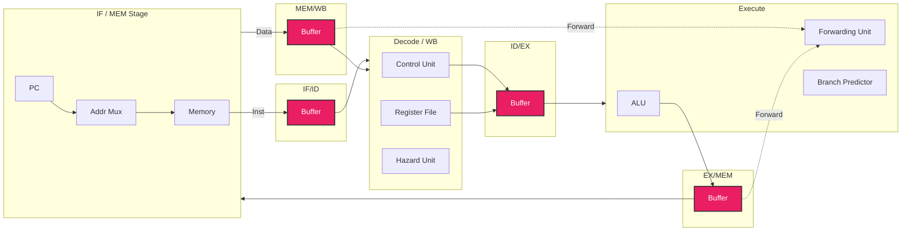
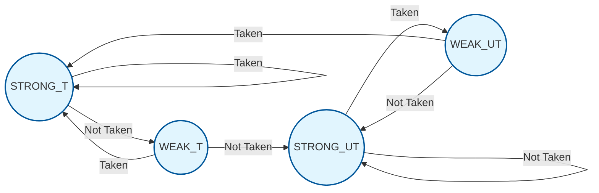
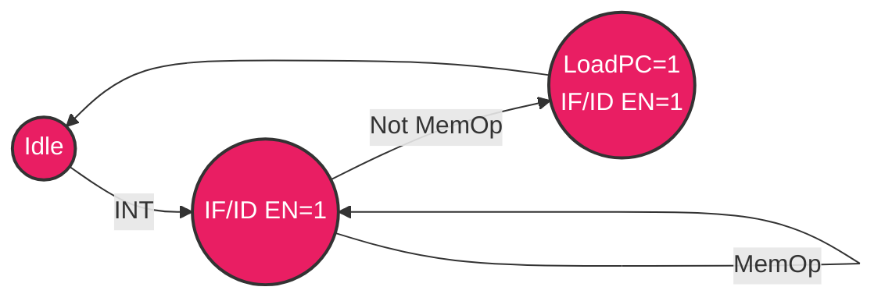

# VHDL Von Neumann Pipelined Processor

## Introduction
This project implements a **32-bit Von Neumann Pipelined Processor** in VHDL. It features a 5-stage pipeline with robust hazard detection, data forwarding, and dynamic branch prediction. The design handles a shared memory for both instructions and data (Von Neumann architecture), checking for memory access conflicts between the Fetch and Memory stages.

## Features
- **5-Stage Pipeline**: Fetch, Decode, Execute, Memory, Write Back.
- **Von Neumann Architecture**: Shared memory for instructions and data.
- **Hazard Detection Unit**: Detects data hazards and structural hazards (memory contention).
- **Forwarding Unit**: Solves data hazards by forwarding results from EX/MEM and MEM/WB stages to the EX stage.
- **Dynamic Branch Prediction**: Uses a 2-bit saturating counter for conditional jumps.
- **Interrupt Handling**: Supports hardware interrupts with a dedicated FSM (`LoadToPCFSM`) to manage PC loading safety.
- **Structural Hazard Handling**: Prioritizes data memory access over instruction fetch when conflicts occur (`IF_MEM_Stage`).

## Architecture & Design Flow

The processor consists of the following key components integrated into `Full_Integration_Branch_Prediction.vhd`:

1.  **IF_MEM_Stage**: Handles both **Instruction Fetch** and **Memory Access** (Load/Store). It grants priority to memory operations to resolve structural hazards inherent in Von Neumann architecture.
2.  **IF/ID Register**: Buffers instructions between Fetch and Decode.
3.  **WB_D_Stage (Decode & Write Back)**: Decodes instructions, generates control signals (`ControlUnit`), and writes handling back to the Register File.
4.  **ID/EX Register**: Buffers data/control for the Execute stage.
5.  **EX_Stage**: Performs ALU operations and calculates branch addresses.
6.  **EX/MEM Register**: Buffers results for the Memory stage.
7.  **MEM/WB Register**: Buffers data for the Write Back stage.
8.  **Hazard Detection Unit**: Stalls the pipeline or flushes registers when necessary (e.g., Load-Use hazard, Branch flush).
9.  **Forwarding Unit**: Forwards data to ALU inputs.

### Pipeline Diagram

## Finite State Machines (FSMs)

### 1. Two-Bit Branch Predictor
This FSM predicts whether a conditional branch will be taken.
- **States**: `STRONG_TAKEN`, `WEAK_TAKEN`, `STRONG_UNTAKEN`, `WEAK_UNTAKEN`.
- **Logic**: Transition based on actual branch outcome (`IDEX_ConditionalJMP`) vs predicted.

### 2. LoadToPC FSM (Interrupt Controller)
This FSM manages loading the Interrupt Service Routine (ISR) address into the PC, ensuring no memory operation is currently active.

## Control Signals
Control signals are generated by the `ControlUnit` based on the instruction opcode.

| Signal | Function | Active for Instructions |
| :--- | :--- | :--- |
| **MemToReg** | Selects Memory data (1) vs ALU (0) for WB | `POP`, `LDD` |
| **RegWrite** | Enables writing to Register File | `ALUOP`, `IN`, `POP`, `IADD`, `LDM`, `LDD`, `SWAP`, `SETC` |
| **PCStore** | Stores PC+1 to Memory/Stack | `CALL`, `INT` |
| **MemOp_Inst** | Indicates a Memory Instruction | `POP`, `LDD`, `RET`, `RTI`, `PUSH`, `CALL`, `INT`, `STD` |
| **MemRead** | Enables Memory Read | `POP`, `LDD`, `RET`, `RTI` |
| **MemWrite** | Enables Memory Write | `PUSH`, `CALL`, `INT`, `STD` |
| **ALUSrc** | Selects Immediate (1) vs Reg2 (0) for ALU | `IADD`, `LDM`, `LDD`, `STD` |
| **JMPCALL** | Indicates Jump or Call | `JMP`, `CALL` |
| **StackOpType** | Defines Stack Operation (Push/Pop) | `POP`, `RET`, `RTI` (Read/Pop) vs `CALL`, `INT`, `PUSH` (Write/Push) |
| **InputOp** | Reads from Input Port | `IN` |
| **OutOp** | Writes to Output Port | `OUT` |
| **HLT** | Halts the Processor | `HLT` |

*Note: Extracting exact bit mappings from `ControlUnit.vhdl`.*

## Design Details
- **Memory Priority**: In `IF_MEM_Stage`, if `MemOp_Priority_IN` is high (Data access), `demuxInst` is zeroed out, effectively stalling the fetch or inserting NOPs until data access completes.
- **Forwarding**: The `forwardUnit` compares source registers in ID/EX with destination registers in EX/MEM and MEM/WB to select the correct ALU operands.

## Deep Dive: Architecture Internals

### 1. Hazard Unit logic
The `HazardUnit.vhd` handles pipeline stalls and flushes to maintain data integrity and control flow.

- **Load-Use Hazard**: Detected when an instruction in Decode reads a register that is being loaded by the previous instruction in Execute (`IDEX_MemRead = '1'`).
  - **Action**: Stalls the PC and IF/ID pipeline registers (`HU_IFID_EN = '1'`, `HU_PCWrite_OUT = '1'`) and flushes the ID/EX register (`HU_IDEX_FLUSH = '1'`).
- **Branch/Jump Flush**:
  - **Misprediction**: If the Branch Predictor is wrong (`prediction xor IDEX_ConditionalJMP`), the pipeline flushes the IF/ID and ID/EX registers to discard instructions fetched from the wrong path.
  - **Unconditional Jump/Call**: Flushes the IF/ID register immediately upon detecting a JMP/CALL in the Decode stage.
- **Return (RET/RTI) Handling**: Stalls the pipeline until the return address is actually popped from the stack in the Memory stage (`EX_MEM_RET`).

### 2. Forwarding Unit
The `forwardUnit.vhd` implements standard "RAW" (Read-After-Write) hazard resolution.
- **ALU-to-ALU**: Forwards from the EX/MEM stage if the destination register matches a source in the current ID/EX stage.
- **MEM-to-ALU**: Forwards from the MEM/WB stage if the destination register matches a source, handling the case where a result is ready to be written back but needed immediately.

### 3. ALU Operations
The `ALU` supports the following operations based on the opcode:
- **Math**: `ADD`, `SUB`, `INC` (Increment), `IADD` (Immediate Add).
- **Logic**: `AND`, `NOT`.
- **Data Movement**: `MOV` (Pass through A), `SWAP` (Pass through B/Swap logic handled externally).
- **Flags**: `SETC` (Set Carry).
- **Flag Generation**: Updates Zero (Z), Negative (N), and Carry (C) flags based on the operation result.

### 4. Instruction Set Architecture (ISA)
The processor supports the following instructions, assembled via `Assembler/Assembler.py`:

| Opcode | Mnemonic | Format | Description |
| :--- | :--- | :--- | :--- |
| `00000` | **NOP** | `NOP` | No Operation |
| `00001` | **HLT** | `HLT` | Halt Processor |
| `00010` | **SETC** | `SETC` | Set Carry Flag |
| `00010` | **NOT** | `NOT Rdst` | Bitwise NOT |
| `00010` | **INC** | `INC Rdst` | Increment Register |
| `00010` | **MOV** | `MOV Rdst, Rsrc` | Move Register to Register |
| `01000` | **MOVS** | `MOVS Rdst, Rsrc` | Move with specific immediate (Legacy/Variant) |
| `00010` | **ADD** | `ADD Rdst, Rsrc1, Rsrc2` | Add Rsrc1 + Rsrc2 |
| `00010` | **SUB** | `SUB Rdst, Rsrc1, Rsrc2` | Subtract Rsrc1 - Rsrc2 |
| `00010` | **AND** | `AND Rdst, Rsrc1, Rsrc2` | Bitwise AND |
| `00011` | **OUT** | `OUT Rsrc1` | Output to Port |
| `00100` | **IN** | `IN Rdst` | Input from Port |
| `00110` | **PUSH** | `PUSH Rsrc2` | Push to Stack |
| `00111` | **POP** | `POP Rdst` | Pop from Stack |
| `01001` | **IADD** | `IADD Rdst, Rsrc, Imm` | Immediate Add |
| `01010` | **LDM** | `LDM Rdst, Imm` | Load Immediate to Register |
| `01011` | **JZ** | `JZ Imm` | Jump if Zero |
| `01100` | **JN** | `JN Imm` | Jump if Negative |
| `01101` | **JC** | `JC Imm` | Jump if Carry |
| `01110` | **JMP** | `JMP Imm` | Unconditional Jump |
| `01111` | **CALL** | `CALL Imm` | Call Subroutine |
| `10000` | **RET** | `RET` | Return from Subroutine |
| `10001` | **INT** | `INT index` | Hardware Interrupt (0 or 1) |
| `10010` | **RTI** | `RTI` | Return from Interrupt |
| `10011` | **LDD** | `LDD Rdst, offset(Rsrc)` | Load Direct from Memory |
| `10100` | **STD** | `STD Rsrc2, offset(Rsrc1)` | Store Direct to Memory |
| `11111` | **SWAP** | `SWAP Rdst, Rsrc` | Swap Registers |